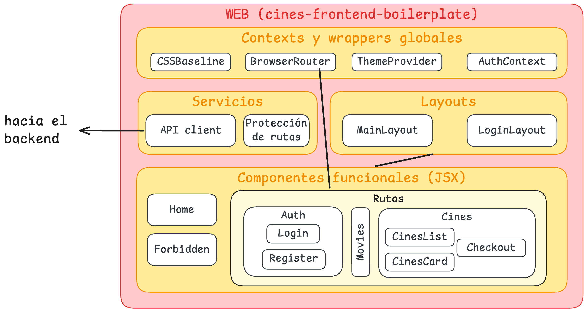

# Cines Frontend Boilerplate - Release FINAL - PSE 2026

Este repositorio contiene un *boilerplate* o plantilla inicial para construir un **frontend** con el *stack* tecnológico final que utilizaremos en la asignatura. La plantilla contiene lo realizado a nivel *frontend* durante todos los laboratorio de la asignatura.

Contiene:

- **(Laboratorio 4)** Inicialización del frontend con **React** + **TypeScript**
- **(Laboratorios 3-4)** Implementación del CRUD completo de Cines con sus carteleras (no hay CRUD de carteleras) mediante **componentes funcionales** y widgets de Material UI
- Tipados y DTOs
- **(Laboratorios 3-4)** Implementación del CRUD completo de Películas en formato tabla
- **(Laboratorio 5)** Autenticación y autorización mediante un **AuthContext** personalizado. Manejo de JWTs y lógica de protección de rutas.
- **(Laboratorios 5-6)** Layouts y botones dinámicos por rol
- **(Laboratorio 6)** Implementación de un **tema de color** 
- **(Laboratorio 6)** Layouts completos, sidebar, buenas prácticas de *frontend*, feedback visual...
- **(Laboratorio 7)** Integración de una API externa que simula **pasarela de pagos** de forma **SEGURA** (evitando mandar los datos de la tarjeta de crédito - ya que son sensibles - directamente desde el front... Ojo con esto...)
- **Todo el código comentado**

Expone dos rutas:

- `/` que muestra una *landing page* personalizada
- `/cinemas` que hace la llamada a la API y en caso de éxito, renderiza el listado de cines
- `/movies` que hace la llamada a la API y renderiza el listado de películas

## Arquitectura

## Uso

1. Clonar el repositorio y `npm install` para instalar las dependencias
2. `npm run dev` para ejecutar el servidor